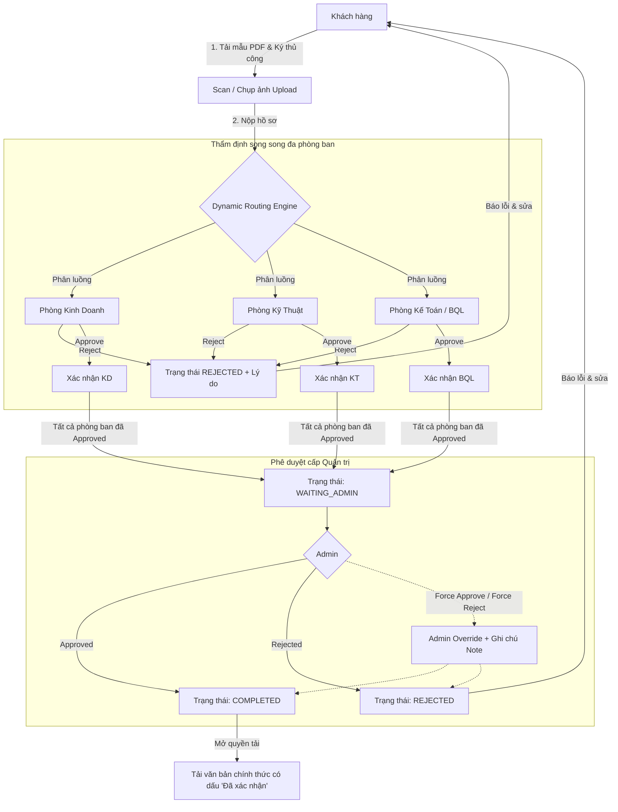

# **TÀI LIỆU KỸ THUẬT & HƯỚNG DẪN HỆ THỐNG CỔNG THẨM ĐỊNH & PHÊ DUYỆT HỒ SƠ ĐA PHÒNG BAN (PICO SAIGON / PICOPLAZA)**

---

## **1. TỔNG QUAN HỆ THỐNG**

Hệ thống **Cổng Dịch Vụ & Tiếp Nhận, Thẩm Định, Phê Duyệt Hồ Sơ Trực Tuyến** được phát triển theo đặc tả trong tài liệu [Dexuat.pdf](file:///c:/xampp56/htdocs/picoplaza/Dexuat.pdf), hoạt động trên nền tảng **CodeIgniter Framework (PHP/MySQL)** với tiền tố bảng **`picoplaza_`**.

Hệ thống kế thừa toàn bộ hạ tầng bảo mật, helpers, cơ chế bắn thông báo khẩn qua **Telegram Bot** và **Mailjet REST API v3.1** từ dự án Pico Plaza, đồng thời được tách biệt mã nguồn thành các module độc lập.

---

## **2. CẤU TRÚC CƠ SỞ DỮ LIỆU (DATABASE SCHEMA)**

Script nạp CSDL hoàn chỉnh được lưu tại: **[picoplaza_workflow.sql](file:///c:/xampp56/htdocs/picoplaza/picoplaza_workflow.sql)**

### **2.1. Bảng `picoplaza_tdepartment` (Danh mục phòng ban)**
* Quản lý các phòng ban tham gia thẩm định chuyên môn:
  * `DEPT_KD`: Phòng Kinh Doanh (Thẩm định giá thuê, hợp đồng).
  * `DEPT_KT`: Phòng Kỹ Thuật (Thẩm định bản vẽ thi công, an toàn PCCC, kết cấu điện nước).
  * `DEPT_KTPL`: Phòng Kế Toán & Pháp Lý (Thẩm định tư cách pháp nhân, tài chính).
  * `DEPT_BQL`: Ban Quản Lý Tòa Nhà (Thẩm định an ninh, vệ sinh, phương án ra vào).

### **2.2. Bảng `picoplaza_tdoc_type` (Cấu hình loại hồ sơ & Luồng duyệt)**
* Quản lý biểu mẫu chuẩn và danh sách phòng ban duyệt song song (`cdepts_required`).
  * Ví dụ: Loại hồ sơ Đăng ký thi công yêu cầu phòng 2 (Kỹ thuật) và phòng 4 (Ban quản lý) duyệt song song (`cdepts_required = '2,4'`).

### **2.3. Bảng `picoplaza_tdoc_submission` (Hồ sơ khách hàng nộp)**
* Chứa toàn bộ thông tin hồ sơ:
  * `ccode`: Mã định danh hồ sơ (`HS-YYYYMM-XXXX`).
  * `cstatus`: `INIT` $\rightarrow$ `IN_REVIEW` $\rightarrow$ `WAITING_ADMIN` $\rightarrow$ `COMPLETED` / `REJECTED`.
  * `cfile_path`: Tệp scan/ảnh hồ sơ gốc khách hàng nộp.
  * `cfile_approved`: Tệp văn bản chính thức đã xác nhận cấp quyền cho khách hàng tải về.
  * `is_override`: Đánh dấu hồ sơ có sự can thiệp Admin Override.
  * `cadmin_note`: Ghi chú can thiệp của Quản trị viên.

### **2.4. Bảng `picoplaza_tdoc_approval_step` (Vết duyệt của từng phòng ban)**
* Lưu trạng thái thẩm định độc lập của từng phòng ban: `PENDING`, `APPROVED`, `REJECTED` kèm lý do `creason_note` và thời gian thao tác.

### **2.5. Bảng `picoplaza_tdoc_log` (Nhật ký kiểm toán / Audit Trail)**
* Ghi lại lịch sử chi tiết mọi thao tác (Ai thao tác, IP nào, đổi trạng thái gì, nội dung ghi chú).

---

## **3. QUY TRÌNH 4 BƯỚC VẬN HÀNH & WORKFLOW ENGINE**

### **Bước 1: Khởi tạo & Upload**
* Khách hàng truy cập `/portal-tham-dinh` $\rightarrow$ Tải mẫu PDF chuẩn $\rightarrow$ Ký xác nhận $\rightarrow$ Scan/Chụp ảnh tải lên hệ thống.
* Trạng thái hồ sơ chuyển sang **`IN_REVIEW`**.

### **Bước 2: Thẩm định song song tại các phòng ban (Parallel Review)**
* Hệ thống tự động phân phối hồ sơ đến Cổng thẩm định của các phòng ban được chỉ định (`/admin/do_dept_review_listview`).
* **Quy tắc duyệt độc lập**:
  1. **Nếu 1 phòng ban Từ chối (Reject)**: Bắt buộc nhập lý do $\rightarrow$ Toàn bộ hồ sơ ngay lập tức chuyển sang **`REJECTED`** $\rightarrow$ Hệ thống tự động gửi email thông báo chi tiết lý do cho khách hàng.
  2. **Nếu tất cả các phòng ban được chỉ định Phê duyệt (Approve)**: Hệ thống tự động kích hoạt chuyển trạng thái sang **`WAITING_ADMIN`** và bắn thông báo khẩn lên Telegram Bot nhóm Quản trị.

### **Bước 3: Phê duyệt cấp Quản trị (Admin Review)**
* Admin truy cập `/admin/do_doc_submission_listview` để kiểm tra tổng thể chữ ký/xác nhận từ các phòng ban.
* Quyết định:
  * **Thông qua (Approved)**: Tải lên văn bản chính thức có dấu xác nhận $\rightarrow$ Chuyển trạng thái **`COMPLETED`**.
  * **Từ chối (Rejected)**: Nhập lý do từ chối $\rightarrow$ Chuyển trạng thái **`REJECTED`**.

### **Bước 4: Trả kết quả**
* Trạng thái chuyển thành **`COMPLETED`**.
* Mở nút tải văn bản chính thức với ghi chú *"Đã xác nhận"* tại trang theo dõi `/portal-tham-dinh/theo-doi/:code`.

---

## **4. CƠ CHẾ QUẢN TRỊ & CAN THIỆP ĐẶC BIỆT (ADMIN OVERRIDE)**

Quản trị viên (Admin) được trang bị quyền can thiệp cưỡng chế trong các tình huống khẩn cấp:

1. **`Force Approve`**:
   * Phê duyệt nhanh, bỏ qua các bước xét duyệt còn lại của các phòng ban chưa kịp duyệt.
   * Tự động đánh dấu hoàn tất toàn bộ các bước và chuyển hồ sơ sang `COMPLETED`.
2. **`Force Reject`**:
   * Hủy / Dừng xử lý hồ sơ lập tức ở bất kỳ giai đoạn nào.
3. **Ràng buộc kiểm soát & An toàn dữ liệu**:
   * Bắt buộc phải nhập **`Admin Note`** nêu rõ lý do can thiệp.
   * Hệ thống tự động gắn nhãn `OVERRIDE` và ghi log chi tiết vào bảng kiểm toán `picoplaza_tdoc_log`.

---

## **5. DANH MỤC FILE & CÁC THÀNH PHẦN MÃ NGUỒN ĐÃ TRIỂN KHAI**

### **5.1. Database**
* [picoplaza_workflow.sql](file:///c:/xampp56/htdocs/picoplaza/picoplaza_workflow.sql): CSDL bảng biểu luồng thẩm định.

### **5.2. Core Helper & Workflow Engine**
* [application/helpers/workflow_helper.php](file:///c:/xampp56/htdocs/picoplaza/application/helpers/workflow_helper.php): Động cơ phân luồng, duyệt song song, admin override, audit log, bắn Telegram và Mailjet.
* [admin/application/helpers/workflow_helper.php](file:///c:/xampp56/htdocs/picoplaza/admin/application/helpers/workflow_helper.php): Helper phía CMS.

### **5.3. Phân hệ Khách hàng (Frontend)**
* [Doc_portal.php](file:///c:/xampp56/htdocs/picoplaza/application/controllers/Doc_portal.php): Controller chính phía Frontend.
* [doc_portal/index.php](file:///c:/xampp56/htdocs/picoplaza/application/views/doc_portal/index.php): Cổng danh mục biểu mẫu & tra cứu.
* [doc_portal/submit.php](file:///c:/xampp56/htdocs/picoplaza/application/views/doc_portal/submit.php): Form nộp hồ sơ & upload file an toàn.
* [doc_portal/track.php](file:///c:/xampp56/htdocs/picoplaza/application/views/doc_portal/track.php): Dòng thời gian tiến độ, ma trận phòng ban, tải văn bản chính thức.

### **5.4. Phân hệ Thẩm định Phòng ban & Admin (Backend CMS)**
* [Do_dept_review_listview.php](file:///c:/xampp56/htdocs/picoplaza/admin/application/controllers/Do_dept_review_listview.php): Danh sách hồ sơ phân phối theo chuyên môn phòng ban.
* [Do_dept_review.php](file:///c:/xampp56/htdocs/picoplaza/admin/application/controllers/Do_dept_review.php): Chi tiết thẩm định, Document Viewer, Approve / Modal Reject.
* [Do_doc_submission_listview.php](file:///c:/xampp56/htdocs/picoplaza/admin/application/controllers/Do_doc_submission_listview.php): Quản trị tổng thể ma trận hồ sơ cho Admin.
* [Do_doc_submission.php](file:///c:/xampp56/htdocs/picoplaza/admin/application/controllers/Do_doc_submission.php): Phê duyệt cuối và xử lý Admin Override (Force Approve / Reject).
* [Do_doc_type_listview.php](file:///c:/xampp56/htdocs/picoplaza/admin/application/controllers/Do_doc_type_listview.php) & [Do_doc_type.php](file:///c:/xampp56/htdocs/picoplaza/admin/application/controllers/Do_doc_type.php): Module quản trị động các loại hồ sơ, upload biểu mẫu PDF và cấu hình phòng ban thẩm định song song.
* Views tương ứng tại [admin/application/views/do_dept_review/](file:///c:/xampp56/htdocs/picoplaza/admin/application/views/do_dept_review/), [admin/application/views/do_doc_submission/](file:///c:/xampp56/htdocs/picoplaza/admin/application/views/do_doc_submission/) và [admin/application/views/doc_type_view/](file:///c:/xampp56/htdocs/picoplaza/admin/application/views/doc_type_view/).

### **5.5. Cấu hình Routes & Menu**
* [application/config/routes.php](file:///c:/xampp56/htdocs/picoplaza/application/config/routes.php): Định tuyến thân thiện `/portal-tham-dinh`, `/portal-tham-dinh/nop-ho-so`, `/portal-tham-dinh/theo-doi/:code`.
* [admin/application/views/modules/mod_header.php](file:///c:/xampp56/htdocs/picoplaza/admin/application/views/modules/mod_header.php): Thêm menu sidebar CMS.
* [application/views/modules/mod_header.php](file:///c:/xampp56/htdocs/picoplaza/application/views/modules/mod_header.php): Thêm menu điều hướng Frontend.

---

## **6. HƯỚNG DẪN KÍCH HOẠT & VẬN HÀNH**

1. **Nạp CSDL**: Import file [picoplaza_workflow.sql](file:///c:/xampp56/htdocs/picoplaza/picoplaza_workflow.sql) vào database `picoplaza` trong phpMyAdmin hoặc Navicat.
2. **Truy cập Frontend**:
   * URL Cổng hồ sơ: `http://localhost/picoplaza/portal-tham-dinh`
   * URL Nộp hồ sơ: `http://localhost/picoplaza/portal-tham-dinh/nop-ho-so`
3. **Truy cập Quản trị CMS**:
   * URL Cổng Thẩm định Phòng ban: `http://localhost/picoplaza/admin/index.php/do_dept_review_listview`
   * URL Quản trị Admin: `http://localhost/picoplaza/admin/index.php/do_doc_submission_listview`
   * URL Cấu hình Loại Hồ Sơ & Biểu Mẫu: `http://localhost/picoplaza/admin/index.php/do_doc_type_listview`
